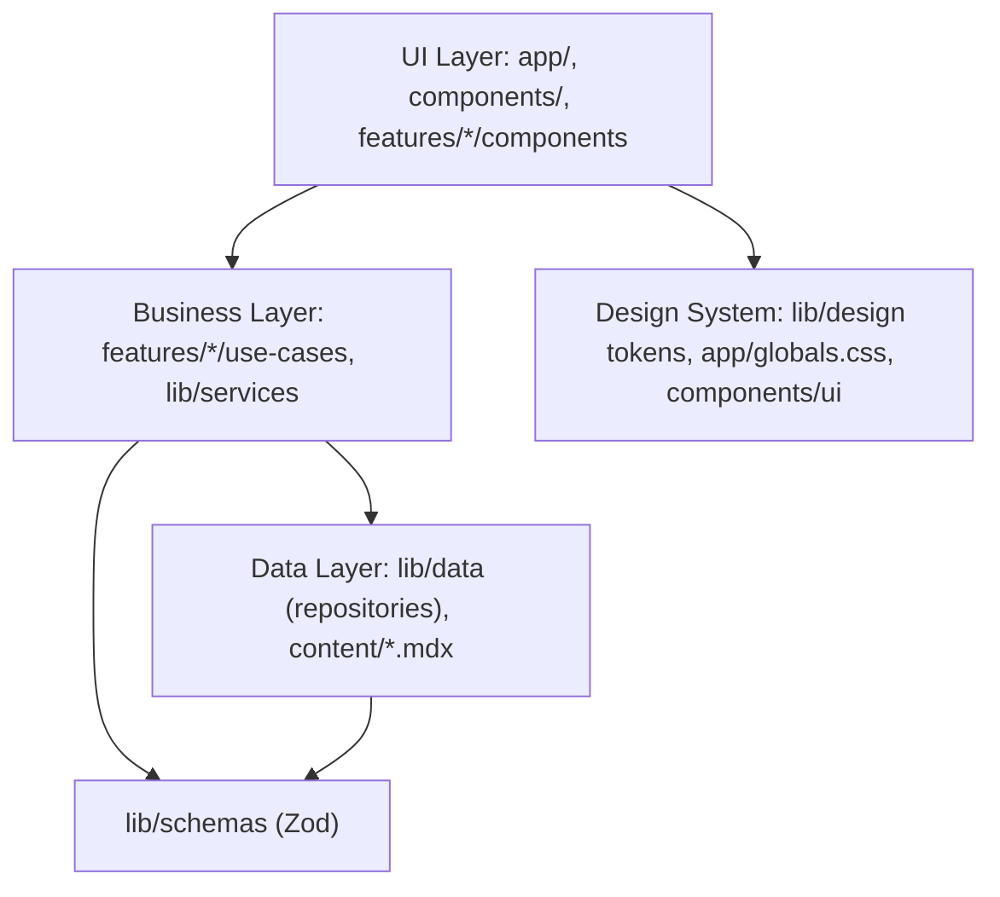

# Immersive Portfolio Website - Foundation + Homepage Journey

Decisions locked in: realistic placeholder content (typed data + MDX, easy to swap), Motion (Framer Motion) + native CSS scroll-driven animations + View Transitions API, and a "foundation + full homepage journey" scope (blog/contact scaffolded, full polish iterated later).

## Architecture

Keep the existing root-based layout (`@/*` -> `./`). Introduce clean-architecture layers with dependencies flowing inward (UI -> business -> data):

- Data layer (`lib/data/`): repositories that read content (`projects.ts`, `posts.ts` reading `content/blog/*.mdx` frontmatter via `gray-matter`), validated by Zod.
- Business layer (`lib/services/`, `features/*/use-cases`): reading-time, TOC extraction, blog search/filter/sort, contact submission use case.
- UI layer: `app/` routes, shared `components/`, and feature modules under `features/` (hero, about, skills, projects, blog, contact), each owning its section component, motion language, and tests.

## Design System & Theming

- Extend `[app/globals.css](app/globals.css)` `@theme` with tokens beyond color: spacing scale, z-index layers, motion durations/easings, elevation. Keep all values as CSS variables (single source of truth).
- Add `lib/design/tokens.ts` exporting TS-typed motion tokens (durations, easings, spring configs) so Motion and CSS stay in sync. No hardcoded values in components.
- Theming via `next-themes` (class strategy, matches existing `@custom-variant dark`). Add `components/theme/theme-provider.tsx` (client) + an accessible theme toggle. New themes = add a CSS class block + token map; components never reference hardcoded theme values.

## Motion System

- Add `motion` package. Create `components/motion/` primitives: `MotionConfigProvider` (wires `prefers-reduced-motion`), reusable `Reveal`, `Parallax`, `ScrollScene` wrappers built on `useScroll`/`useTransform`.
- `hooks/use-reduced-motion.ts` and a scroll-progress context so chapters can react to global scroll position.
- Section transitions use React `<ViewTransition>` + `Link transitionTypes` for project detail navigation (morph shared elements). Enable `experimental.viewTransition: true` in `[next.config.ts](next.config.ts)`.

## Homepage Journey (continuous story)

Single scroll experience in `[app/page.tsx](app/page.tsx)` composed of feature sections, each with a distinct layout + interaction model:

- Hero - interactive, curiosity-driven intro (Server-rendered shell + small client island for interaction).
- About - scroll-driven narrative timeline/path.
- Skills - interactive visualization (relationship graph / constellation), not progress bars.
- Projects - each project as an immersive "destination" with problem/challenge/process/solution/outcome; cards morph into detail via View Transitions.
- Blog teaser - latest posts pulling from the data layer.
- Contact - conclusion with form + social links.

Keep interactivity in small client islands; sections and data fetching stay Server Components for performance.

## Blog System (scaffold + working core)

- `@next/mdx` config in `[next.config.ts](next.config.ts)` (rename to `.mjs`/keep `.ts`), `pageExtensions` updated, `mdx-components.tsx` at root. Plugins passed as strings (Turbopack constraint): `remark-gfm`, `rehype-slug`, `rehype-autolink-headings`, `rehype-pretty-code` (Shiki) for syntax highlighting.
- Content in `content/blog/*.mdx` with frontmatter; listing/search/categories/tags from `lib/data/posts.ts`. Routes: `app/blog/page.tsx`, `app/blog/[slug]/page.tsx`, category/tag filters.
- Reading time (`reading-time`), TOC from headings, `@tailwindcss/typography` for prose, RSS at `app/rss.xml/route.ts`.

## Contact System

- `features/contact` form (client) with Zod validation + a Server Action use case; accessible labels/errors, success/error states, social links from config.

## SEO

- Metadata API in `[app/layout.tsx](app/layout.tsx)` + per-route `generateMetadata` (blog). OG images via `opengraph-image.tsx` (`ImageResponse`). JSON-LD (Person + BlogPosting), `app/sitemap.ts`, `app/robots.ts`, canonical URLs, semantic HTML.

## Testing & Quality

- Unit (vitest + RTL): tokens, hooks, use-cases, key components. Add `@testing-library/jest-dom`, `@testing-library/user-event`, a vitest setup file.
- Integration: theme switching, blog filter/search, contact form validation.
- E2E (Playwright + `@axe-core/playwright`): homepage journey, blog reading, contact submit, theme switch, responsive + accessibility (keyboard/focus). Add `playwright.config.ts` + `e2e/`.
- Add a `typecheck` script (`tsc --noEmit`); husky already runs lint/format/test. Honor strict oxlint (no `any`, type-only imports).

## Dependencies to add

- Runtime: `motion`, `next-themes`, `zod`, `@next/mdx`, `@mdx-js/loader`, `@mdx-js/react`, `gray-matter`, `reading-time`, `remark-gfm`, `rehype-slug`, `rehype-autolink-headings`, `rehype-pretty-code`, `shiki`.
- Dev: `@types/mdx`, `@tailwindcss/typography`, `@playwright/test`, `@axe-core/playwright`, `@testing-library/jest-dom`, `@testing-library/user-event`.

## Notable risks / decisions

- Turbopack restricts MDX plugins to serializable string config - use string plugin names only.
- View Transitions are progressive enhancement (no-op without browser support); reduced-motion disables transition durations globally.
- Clean-architecture layering is applied pragmatically to avoid overengineering a content-driven site (KISS/YAGNI).
